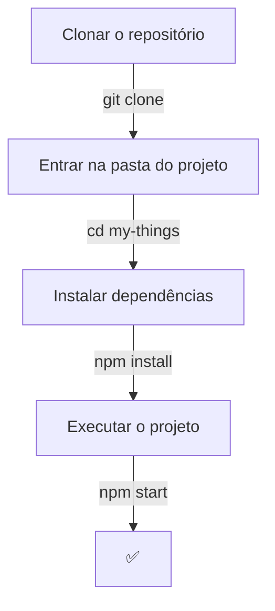

<h2 align=center> T H I N G S 💵</h2>

<em>Things é um aplicativo desenvolvido em React para gerenciamento pessoal de gastos, veículos e outros bens de forma simples e eficiente.  
O objetivo é centralizar informações importantes do seu dia a dia em um só lugar, com uma interface intuitiva e responsiva.</em>
 
 

