```mermaid
flowchart TD
    A[Clonar o repositório] -->|git clone| B[Entrar na pasta do projeto]
    B -->|cd my-things| C[Instalar dependências]
    C -->|npm install| D[Executar o projeto]
    D -->|npm start| E[✅]
```

<h2 align=center> T H I N G S 💵</h2>

<em>Things é um aplicativo desenvolvido em React para gerenciamento pessoal de gastos, veículos e outros bens de forma simples e eficiente.  
O objetivo é centralizar informações importantes do seu dia a dia em um só lugar, com uma interface intuitiva e responsiva.</em>
 
 

